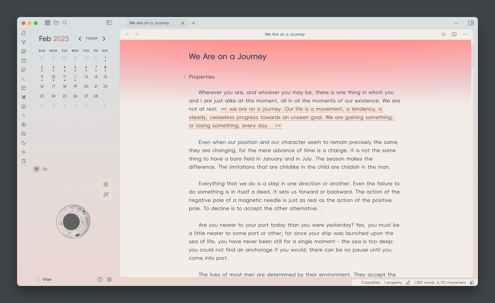
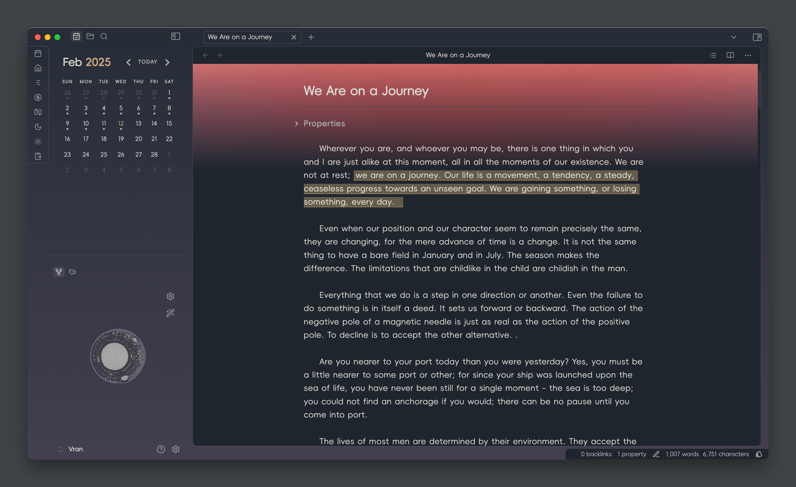
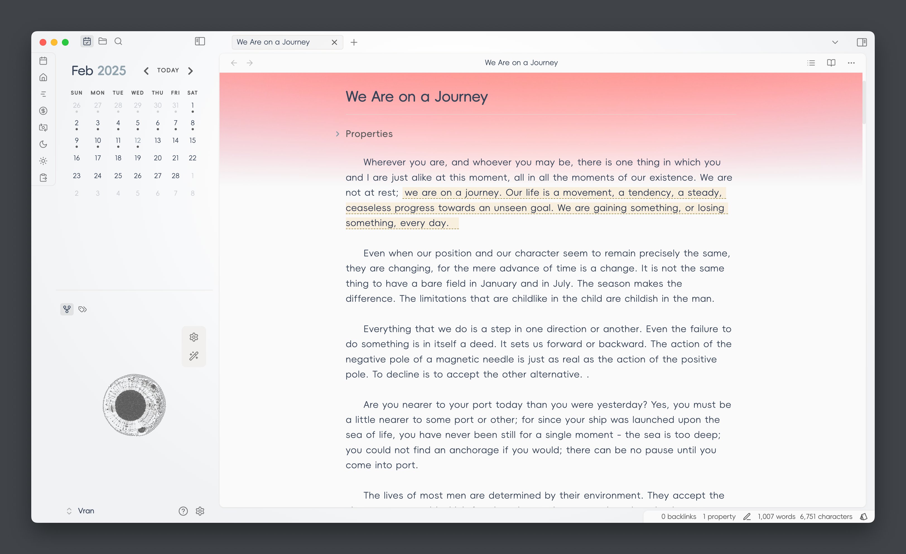
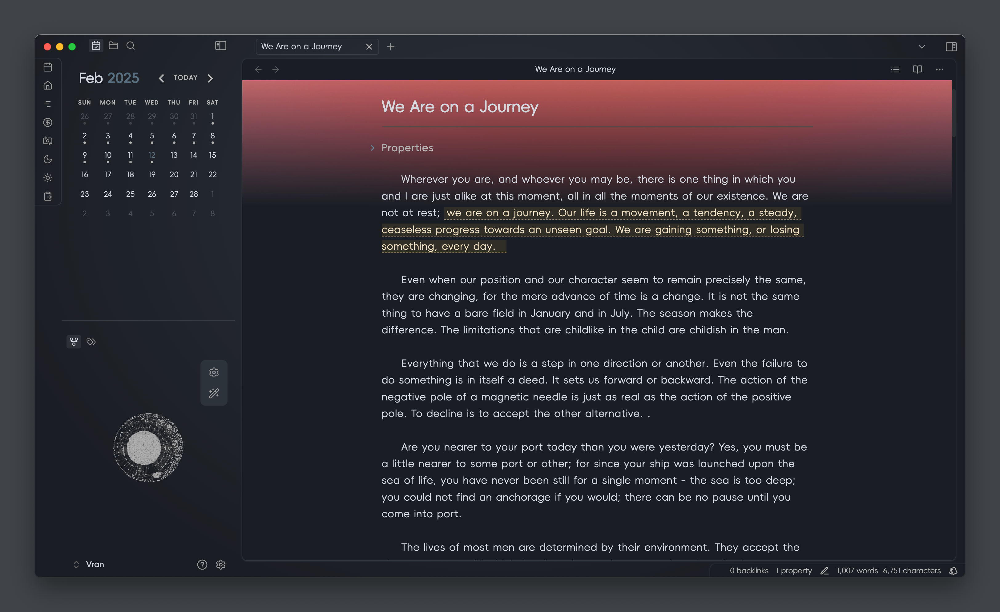
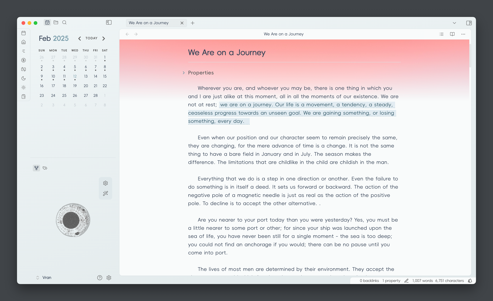
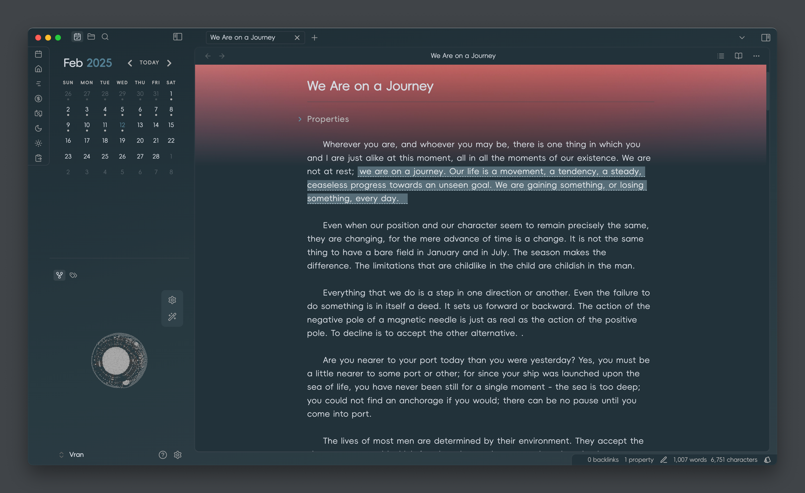
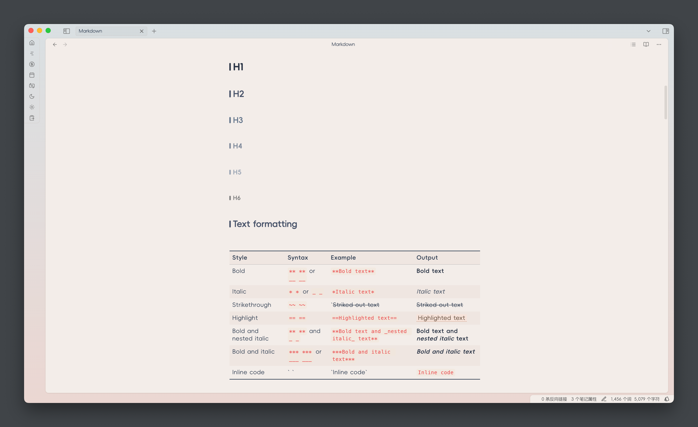
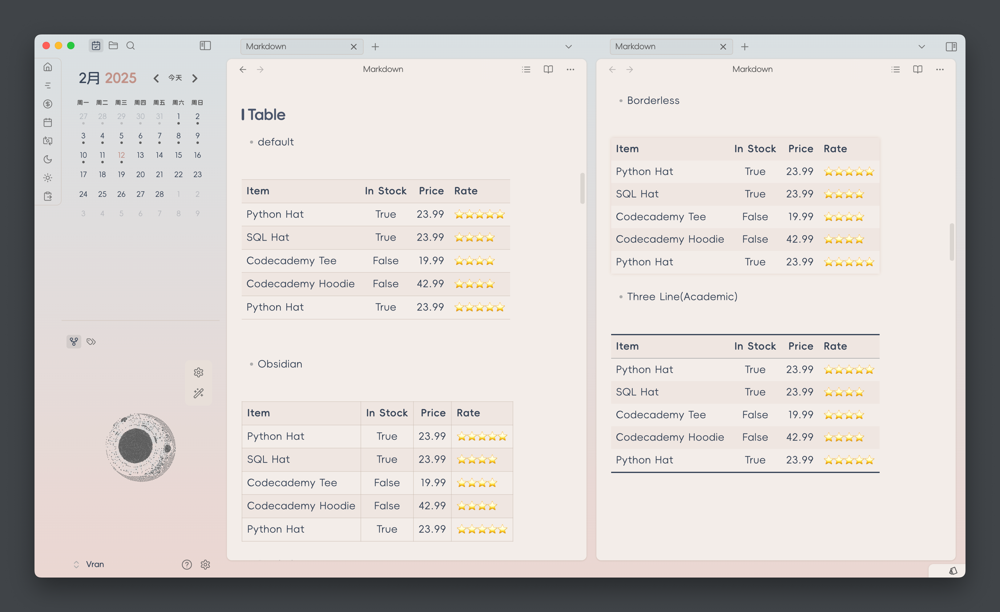
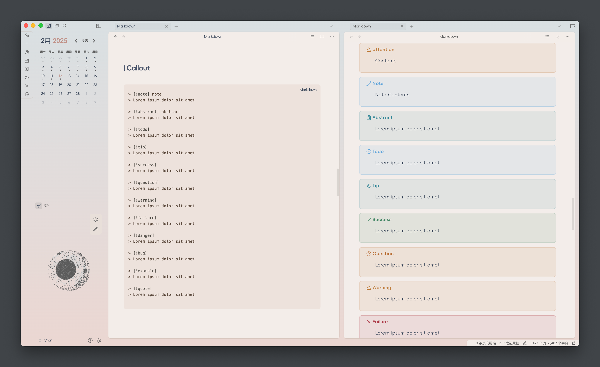

## Brief

an out-of-box theme for Obsidian, which is designed for reading and writing comfortably.

## Screenshots

You can install `style settings` plugin and change the theme color in the plugin setting.

### Color Scheme

> ![note]
> color scheme change needs to install `style settings` plugin

- Xia 霞

- Su 素

- Qing 青

### Text Formatting

### Table

### Callout

## Thanks

- Task checkbox is referenced from [Minimal Theme](https://github.com/kepano/obsidian-minimal) which is a great theme for Obsidian build by @Kepano

