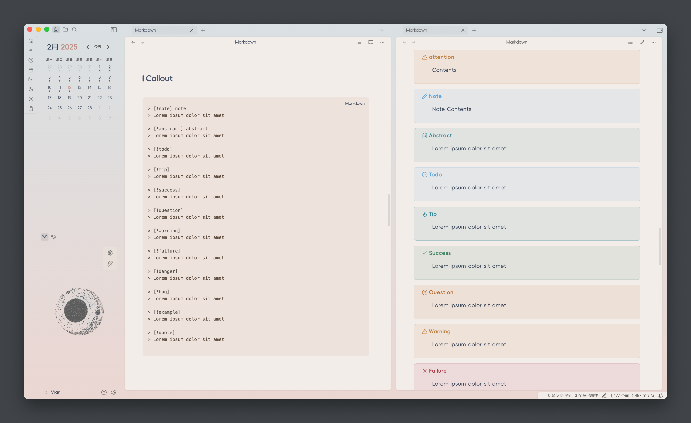

中文 | [English](README.md)
## 简介

一个开箱即用的obsidian主题，为更舒适的阅读与写作体验设计。

## 截图

你可以安装 `style settings` 插件并用它修改Composer配色。

### 配色方案

> [!NOTE]
> 改变配色方案需先安装`style settings`插件

- Xia 霞

- Su 素

- Qing 青

### 文字样式

### 表格样式

### Callout样式

## 鸣谢

- Task的复选框样式参考了[Minimal Theme](https://github.com/kepano/obsidian-minimal)， 来自@Kepano 的一个优秀obsidian主题。

